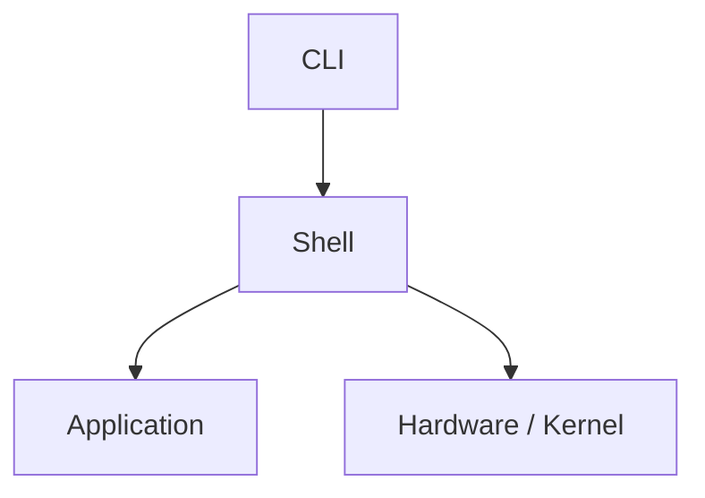

# Linux Session Revision Sheet - Basics, Navigation, Files, Links
*Notes by UNKNOWN — set manually*

A revision sheet covering Linux basics and architecture, command syntax, navigation, file listing and wildcards, file content viewing, file/directory management, `grep` searching, hard/soft links, key filesystem directories, and terminal keyboard shortcuts.

## 1. Linux Basics

### Linux vs. Windows

- Security
- Stability
- Maintenance
- Runs on different hardware
- Free & open source
- Easy to customize
- Community support
- Different user-interface experience

### Linux Architecture



- **Kernel:** Works with the hardware.
- **Shell:** Interface for interacting with the system through commands.

### Swap

Uses part of the storage as additional memory when needed.

## 2. Users and Privileges

| Symbol | Meaning |
|---|---|
| `$` | Regular user |
| `#` | Superuser |

## 3. Command Syntax

```
command  option  argument
```

Example:

```bash
ls -l /dev
```

- A space is required between the command, options, and arguments.
- Options can be combined.

For example:

```bash
ls -ld
```

is equivalent to:

```bash
ls -l -d
```

## 4. Navigation

| Command | Description |
|---|---|
| `pwd` | Print working directory |
| `cd` | Go to home directory |
| `cd ~` | Go to home directory |
| `cd $HOME` | Go to home directory |
| `cd /absolute/path` | Go to an absolute path |
| `cd -` | Go back to the previous directory |

## 5. Listing Files

| Command | Description |
|---|---|
| `ls` | List files |
| `ls -a` | List all files, including hidden files |
| `ls -l` | Long listing |
| `ls -la` | Long listing + hidden files |
| `ls -lt` | Sort by time |
| `ls -ltr` | Sort by time, reverse order |
| `ls -lth` | Long listing + time sorting + human-readable size |

> [!NOTE]
> Files and directories starting with `.` are hidden.

### Wildcards

| Pattern | Meaning |
|---|---|
| `ls p*` | Starts with `p` |
| `ls *p` | Ends with `p` |
| `ls ???` | Exactly 3 characters |
| `ls [a-c]*` | Starts with `a`, `b`, or `c` |
| `ls [!a]*` | Does not start with `a` |
| `ls [!a-c]*` | Does not start with `a`–`c` |

> [!NOTE]
> Inside `[]`, `!` and `^` have the same meaning.

## 6. File Content

| Command | Description |
|---|---|
| `cat file` | Show file content |
| `nano file` | Edit a file |
| `head -n N file` | Show the first `N` lines |
| `tail -n N file` | Show the last `N` lines |

## 7. File & Directory Management

| Command | Description |
|---|---|
| `touch file` | Create an empty file |
| `mkdir dir` | Create a directory |
| `cp file dest` | Copy a file |
| `cp -r dir dest` | Copy a directory recursively |
| `mv file dest` | Move a file |
| `mv file newname` | Rename a file |
| `rm -rf dir` | Force-remove a directory recursively |

### Important Options

```
-r / -R  → recursive
-f       → force
```

> [!DANGER]
> `rm -rf dir` force-removes a directory recursively. This is irreversible — the data is not recoverable.

## 8. Searching with `grep`

Basic command:

```bash
grep hager dir
```

### Useful Options

| Command | Description |
|---|---|
| `grep -i` | Case-insensitive |
| `grep -l` | Show only file names containing the pattern |
| `grep -B N` | Show `N` lines **before** the match |
| `grep -A N` | Show `N` lines **after** the match |

Example:

```bash
grep -i hager dir
grep -l hager dir
grep -B 2 hager dir
grep -A 2 hager dir
```

## 9. Links

Linux supports **hard links** and **soft links**.

### Hard Link

```bash
ln file1 file2
```

- Both names refer to the same data.
- They share the same inode.
- A hard link cannot link directories.
- The data remains as long as at least one hard link still exists.

Example:

```bash
ln file1 file2
```

To remove a hard link:

```bash
rm -rf hard-link
```

> [!WARNING]
> `rm -rf hard-link` is used to remove a hard link. Since `-rf` is destructive, confirm the target before running it.

### Soft Link

A soft link points to a path.

### Inode

- Every file or directory has an **inode** allocated for it.
- A hard link refers to the same inode/data.

## 10. Important Filesystem Directories

| Directory | Purpose |
|---|---|
| `/` | Root of the entire filesystem |
| `/bin` | Essential binaries for regular users |
| `/sbin` | System binaries for the superuser |
| `/dev` | Device files |
| `/etc` | Configuration files |
| `/home` | Users' home directories |
| `/root` | Home directory of the superuser |
| `/tmp` | Temporary files |
| `/var` | Variable data, such as `/var/tmp` |
| `/run` | Runtime data related to services |
| `/local` | Local / customized software |

### Important

```
/       → Root of the filesystem
/root   → Home directory of the superuser
/home   → Home directories of regular users
```

> [!NOTE]
> `/root` is **not** the same as `/home/root`.

## 11. Terminal Keyboard Shortcuts

| Shortcut | Action |
|---|---|
| `Ctrl + A` | Go to the beginning of the command |
| `Ctrl + E` | Go to the end of the command |
| `Ctrl + ← / →` | Move by word |
| `Ctrl + K` | Cut from the cursor to the end of the line |
| `Ctrl + U` | Cut from the cursor to the beginning of the line |

## Flashcards

**Q: What are the three checked advantages of Linux over Windows in this sheet?**
A: Security, Stability, and Maintenance (Linux also runs on different hardware, is free & open source, easy to customize, has community support, and offers a different UI experience).

**Q: What are the roles of the Kernel and the Shell in Linux architecture?**
A: The Kernel works directly with the hardware, while the Shell is the interface for interacting with the system through commands.

**Q: What is Swap used for?**
A: It uses part of the storage as additional memory when needed.

**Q: What do the `$` and `#` prompt symbols indicate?**
A: `$` indicates a regular user, and `#` indicates a superuser.

**Q: What is the basic command syntax in Linux, and can options be combined?**
A: `command option argument`, with spaces required between each part. Options can be combined, e.g. `ls -ld` is equivalent to `ls -l -d`.

**Q: What's the difference between `cd`, `cd ~`, `cd $HOME`, and `cd -`?**
A: `cd`, `cd ~`, and `cd $HOME` all go to the home directory; `cd -` goes back to the previous directory.

**Q: What does `ls -ltr` do compared to `ls -lt`?**
A: `ls -lt` sorts by time; `ls -ltr` sorts by time in reverse order.

**Q: How are hidden files identified in Linux?**
A: Files and directories starting with `.` are hidden.

**Q: What does the wildcard pattern `[!a-c]*` match?**
A: Files that do not start with `a`, `b`, or `c`.

**Q: What's the difference between `head -n N file` and `tail -n N file`?**
A: `head -n N file` shows the first N lines of a file, while `tail -n N file` shows the last N lines.

**Q: What do the `-r`/`-R` and `-f` options mean when used with commands like `cp` or `rm`?**
A: `-r`/`-R` means recursive (applies to directories and their contents), and `-f` means force (skips confirmation).

**Q: What does `grep -B 2 hager dir` do?**
A: Shows the match for "hager" along with the 2 lines before each match.

**Q: What's the difference between `grep -i` and `grep -l`?**
A: `grep -i` makes the search case-insensitive; `grep -l` shows only the names of files containing the pattern, not the matching lines.

**Q: What is an inode, and how does it relate to hard links?**
A: An inode is allocated to every file or directory to store its metadata/data location. A hard link refers to the same inode as the original file — they share the same data.

**Q: Can a hard link point to a directory?**
A: No, a hard link cannot link directories.

**Q: When does the data of a hard-linked file actually get deleted?**
A: The data remains as long as at least one hard link to it still exists.

**Q: What does a soft link point to, as opposed to a hard link?**
A: A soft link points to a path, whereas a hard link points to the same inode/data as the original.

**Q: Is `/root` the same as `/home/root`?**
A: No — `/root` is the home directory of the superuser, and it is explicitly not the same as `/home/root`.

**Q: What is the purpose of `/etc` and `/var`?**
A: `/etc` holds configuration files; `/var` holds variable data, such as `/var/tmp`.

**Q: What do `Ctrl+K` and `Ctrl+U` do in the terminal?**
A: `Ctrl+K` cuts from the cursor to the end of the line; `Ctrl+U` cuts from the cursor to the beginning of the line.
