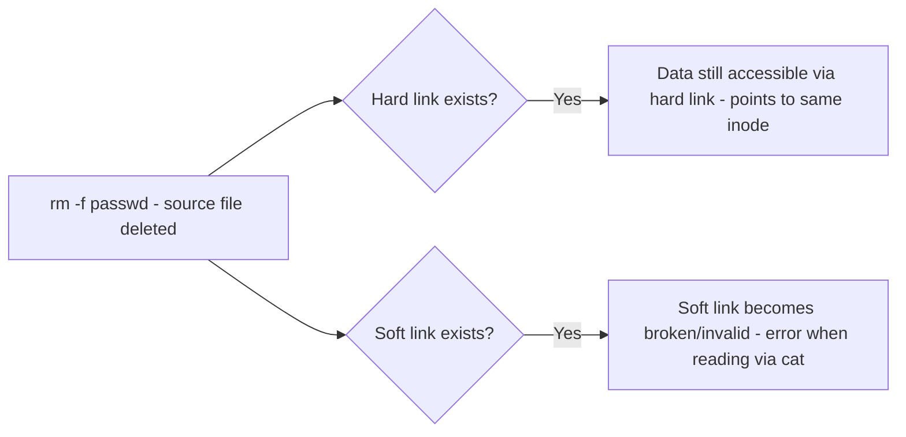

# Comprehensive Linux Commands & File System Notes
*Notes by Michaels*

Notes on directory navigation and paths, file listing and wildcards, file/directory management commands, inodes and hard/soft links, text searching with `grep` and regular expressions, and text processing with `cut`.

## 1. Directory Navigation & Paths

### Working Directory & Path Types

- `pwd` (**Print Working Directory**): Displays the current absolute directory path.
- **Absolute Path**: Path defined from the root directory `/` (e.g., `/usr/share/doc/`).
- **Relative Path**: Path defined relative to the current directory (e.g., `..`, `doc/`).

### Navigation Commands (`cd`)

| Command | Description |
|---|---|
| `cd` | Change directory |
| `cd /` | Move to the Root Directory `/` |
| `cd ~` / `cd $HOME` / `cd /home/<username>` | Move to the current user's Home Directory (contains the 4 basic user directories: Desktop, Documents, Downloads, etc.) |
| `cd /root` | Move to the Root User's Home Directory |
| `cd -` | Switch back to the previous working directory |
| `cd ..` | Move up one level in the directory tree (parent directory) |
| `cd /dev/` | Navigate to system devices directory |
| `cd /run` | Navigate to runtime variable data directory |
| `cd /usr/share/doc/` | Navigate to documentation folder |
| `cd /var/log` | Navigate to system log directory |

`cd -` switches back to the previous working directory.
*(يرجعك لآخر مكان كنت فيه)*

> [!NOTE]
> **Key Question (إيه الفرق بين `~` و `/home/`؟):** `~` represents the home directory of the currently logged-in user (e.g., `/home/omar` for user `omar`, or `/root` for the `root` user). `/home/` is the base directory housing all individual user home folders.

## 2. Directory Listing & File Inspection (`ls`, `dir`, `tree`)

### Basic & Advanced `ls` Flags

- `ls`: Lists files and directories in the current folder.
- `ls /`: Lists contents of the root directory.
- `ls -l`: Detailed long-listing format. Displays file types, permissions (9 bits), link count, owner, group, file size, last modified time, and name.

**File Type Identifiers in `ls -l`:**

| Identifier | Meaning |
|---|---|
| `d` | Directory *(أي directory باللون الأزرق - directories in blue)* |
| `-` | Regular file |
| `l` | Symbolic link |

| Command | Description |
|---|---|
| `ls -la` / `ls -a` | Lists all files, including hidden files (starting with `.`) |
| `ls -lh` | Displays file sizes in Human-Readable formats (KB, MB, GB) |
| `ls -lt` | Sorts output by modification time (newest first) |
| `ls -ltr` | Sorts output by modification time in reverse (oldest first) |
| `ls -lR` / `ls -LR` | Recursive directory listing (lists subdirectories and their contents) |
| `ls -li` | Displays file listing along with Inode numbers |

### `dir` vs `ls`

- `dir`: Similar to `ls`, lists directory contents.
- `dir --color`: Colorizes directory listings to distinguish files and folders.
- Both commands are **case-sensitive**.

### Wildcards & Pattern Matching in `ls`

| Pattern | Meaning |
|---|---|
| `ls file*` | Matches any file starting with `file` |
| `ls [fa]*` | Matches files starting with either `f` or `a` |
| `ls [a-c]*` | Matches files starting with letters `a`, `b`, or `c` |
| `ls [!fa]*` | Matches files NOT starting with `f` or `a` *(إستثناء - exclusion)* |
| `ls [!a-c]*` | Matches files NOT starting with `a`, `b`, or `c` |
| `ls file[[:alpha:]]` | Matches `file` followed by any alphabetic character |
| `ls *[[:space:]]*` | Matches filenames containing space characters |

## 3. File & Directory Management (`touch`, `mkdir`, `cp`, `mv`, `rm`)

### Creating Files & Directories

```bash
touch File1
```
Creates an empty file named `File1` (or updates timestamps if it exists).

```bash
touch File1 File2
```
Creates multiple empty files at once.

```bash
touch /root/Desktop/File1
```
Creates a file at a specific path.

```bash
mkdir dir1
```
Creates a directory named `dir1`.

```bash
mkdir -p dir1/dir2/dir3
```
**Parent flag (`-p`)** creates nested directory structures recursively.
*(بيعمل المجلدات وأجزائها)*

```bash
tree dir1
```
Visualizes directory hierarchy in a tree structure.

```bash
mkdir system/admin
```
Creates nested system/admin directories.

### Copying Files & Directories (`cp`)

| Command | Description |
|---|---|
| `cp /etc/passwd /home/omar` | Copies `/etc/passwd` to `/home/omar` |
| `cp /etc/shadow .` | Copies `/etc/shadow` to the current working directory (`.`) |
| `cp -r /etc/ /home/` | Recursive copy (`-r`): copies directory `/etc/` along with all its subdirectories and contents |
| `cp -r /etc/* /home/` | Copies all contents inside `/etc/` into `/home/` |
| `cp File1 File2 File3 /home/omar` | Copies multiple files into a destination directory |
| `cp /etc/passwd ~` | Copies file to user's home directory |

### Moving & Renaming (`mv`)

| Command | Description |
|---|---|
| `mv passwd new_passwd` | Renames file `passwd` to `new_passwd` (when destination path remains unchanged) |
| `mv new_passwd /root/Documents` | Moves file to `/root/Documents` |
| `mv File1 File2 File3 /root/` | Moves multiple files to `/root/` |
| `mv dir1 dir2 dir3 dir4` | Moves multiple directories or contents |

### Deleting Files & Directories (`rm`, `rmdir`)

```bash
rm File1
```
Removes/deletes `File1`.

```bash
rmdir dir1
```
Removes empty directory `dir1`.

**Aliases & Root Protection:**

> [!TIP]
> `alias rm='rm -i'`: Interactive mode prompts for confirmation before deletion.
> *(يسأل قبل ما يمسح)*
>
> The `root` user defaults to interactive `rm -i` for safety.

```bash
rm -f File1
```
**Force delete (`-f`)** bypasses prompts.
*(يمسح بدون ما يسأل)*

```bash
rm -r dir1
```
**Recursive delete (`-r`)** removes directory and its contents.

```bash
rm -rf dir1
```
Forcefully and recursively removes directory `dir1`.

> [!WARNING]
> `rm -rf *` deletes everything in the current directory.
> *(يمسح كل حاجة)*

> [!DANGER]
> `rm -rf /` deletes the entire system. Irreversible.
> *(يمسح السيستم كله - CRITICAL DANGER)*

## 4. Inodes & Links (Hard Links vs. Soft/Symbolic Links)

### Understanding Inodes

**Inode**: Index node storing metadata about a file (file size, permissions, owner, timestamps, block pointers). Metadatas are stored in the Inode Table.

### Creating & Managing Links

```bash
ln passwd hard-link-passwd
```
Creates a **Hard Link** named `hard-link-passwd`.

```bash
ln -s passwd soft-link1
```
Creates a **Soft/Symbolic Link** (`-s`) named `soft-link1`.

```bash
ls -li
```
Displays Inode numbers along with file details.

### Key Rules & Behavior Differences

| Behavior | Hard Link | Soft Link |
|---|---|---|
| Inode | Points directly to the same Inode as the source file. Increments link count. | Has its own Inode; points to the target filename/path. |
| Deleting source file (`rm -f passwd`) | Data remains accessible because the link points to the underlying Inode/data blocks *(لو مسحت الملف الأصلي، الـ hard link يفضل شغال)* | Becomes broken/invalid *(الـ soft link يقف - broken link error when reading via `cat`)* |
| Works on directories? | ❌ Cannot create hard links for directories *(ميدعمش نعمل hard link لـ directory)* | ✅ Supports directories |
| Works across different filesystems/partitions? | ❌ Cannot create hard links across different filesystems/partitions *(ولا بين different filesystem)* | ✅ Works across different filesystems |



## 5. Text Searching (`grep`) & Regular Expressions

`grep` searches text for patterns and prints matching lines.

### Basic Searching & Flags

```bash
grep omar /etc/passwd
```
Searches for string `omar` in `/etc/passwd`.

```bash
grep bash /etc/passwd
```
Searches for `bash`.

| Command | Description |
|---|---|
| `grep -i bash /etc/passwd` | Case-insensitive search (`-i`) *(Case insensitive - يتجاهل حالة الأحرف)* |
| `grep -v nologin /etc/passwd` | Invert match (`-v`): prints lines that do NOT contain `nologin` *(سيرش على أي line مفيهاش nologin)* |
| `grep -w shut /etc/passwd` | Word match (`-w`): matches whole word `shut` only *(بيدور على كلمة كاملة)* |
| `grep -A 2 root /etc/passwd` | Displays match plus 2 lines AFTER (`-A`) |
| `grep -B 2 root /etc/passwd` | Displays match plus 2 lines BEFORE (`-B`) |
| `grep -r omar /etc` | Recursive search (`-r`): searches all files inside directory `/etc` |
| `grep -rl omar /etc` | Lists only filenames (`-l`) containing the match |
| `grep -e omar -e root /etc/passwd` | Searches for multiple patterns (`-e`) simultaneously (`omar` OR `root`) |

### Regular Expressions with `grep`

Used with dictionary files (e.g., `/usr/share/dict/words`):

| Command | Description |
|---|---|
| `grep '^cat' /usr/share/dict/words` | Matches lines starting with `cat` |
| `grep 'cat$' /usr/share/dict/words` | Matches lines ending with `cat` |
| `grep '^cat$' /usr/share/dict/words` | Matches exact line `cat` |
| `grep 'c.t' /usr/share/dict/words` | Matches `c`, followed by any single character, followed by `t` |
| `grep '^c.t$' /usr/share/dict/words` | Exact 3-letter words starting with `c` and ending with `t` |
| `grep '^c[aou]t$' /usr/share/dict/words` | Exact 3-letter words starting with `c`, middle character `a`, `o`, or `u`, and ending with `t` (e.g., `cat`, `cot`, `cut`) |

## 6. Text Processing (`cut`)

The `cut` command extracts sections from each line of a file.

### Slicing Characters (`-c`)

```bash
cut -c 1-5 /etc/passwd
```
Extracts characters from position 1 to 5 of each line.

```bash
cut -c 5- /etc/passwd
```
Extracts characters from position 5 to the end of each line.

### Delimiters & Fields (`-d`, `-f`)

```bash
cut -d : -f 1 /etc/passwd
```
Sets delimiter (`-d`) to `:` and extracts field 1 (usernames).

```bash
cut -d : -f 1,7 /etc/passwd
```
Extracts fields 1 and 7 (username and login shell).

## Flashcards

**Q: What's the difference between an absolute path and a relative path?**
A: An absolute path is defined from the root directory `/` (e.g., `/usr/share/doc/`), while a relative path is defined relative to the current directory (e.g., `..`, `doc/`).

**Q: What's the difference between `~` and `/home/`?**
A: `~` represents the home directory of the currently logged-in user (e.g., `/home/omar` or `/root`), while `/home/` is the base directory housing all individual user home folders.

**Q: What does `cd -` do?**
A: Switches back to the previous working directory.

**Q: How do you identify a directory, a regular file, and a symbolic link in `ls -l` output?**
A: `d` marks a directory, `-` marks a regular file, and `l` marks a symbolic link.

**Q: What does `ls -li` show that plain `ls -l` doesn't?**
A: It additionally displays the inode numbers of the files.

**Q: What does `mkdir -p dir1/dir2/dir3` do differently from plain `mkdir`?**
A: The `-p` (parent) flag creates the full nested directory structure recursively, creating any missing parent directories along the way.

**Q: What's the difference between `cp -r /etc/ /home/` and `cp -r /etc/* /home/`?**
A: `cp -r /etc/ /home/` copies the `/etc/` directory itself (with its contents) into `/home/`, while `cp -r /etc/* /home/` copies only the contents inside `/etc/` into `/home/`.

**Q: What is the danger of running `rm -rf /`?**
A: It forcefully and recursively deletes the entire system, and this action is irreversible.

**Q: What does `alias rm='rm -i'` do, and why does root use it by default?**
A: It makes `rm` prompt for confirmation before deleting each file. The root user defaults to this for safety, since root has permission to delete anything without restriction.

**Q: What is an inode?**
A: An index node storing metadata about a file, such as file size, permissions, owner, timestamps, and block pointers, stored in the Inode Table.

**Q: What's the difference between a hard link and a soft link if the source file is deleted?**
A: A hard link still works because it points to the same inode as the source file, so the data remains accessible. A soft link breaks because it only points to the target filename/path, producing an error when accessed.

**Q: Can hard links be created for directories or across different filesystems?**
A: No — hard links cannot link directories and cannot be created across different filesystems/partitions. Soft links support both.

**Q: What does `grep -v nologin /etc/passwd` do?**
A: Prints only the lines that do NOT contain "nologin" (inverted match).

**Q: What's the difference between `grep -A 2` and `grep -B 2`?**
A: `-A 2` shows the matching line plus 2 lines after it; `-B 2` shows the matching line plus 2 lines before it.

**Q: What does `grep -w shut /etc/passwd` match that plain `grep shut` would not?**
A: It matches only the whole word `shut`, not `shut` as a substring inside a longer word.

**Q: What does `grep -e omar -e root /etc/passwd` do?**
A: Searches for multiple patterns simultaneously — lines containing `omar` OR `root`.

**Q: What does the regex `grep '^c[aou]t$' /usr/share/dict/words` match?**
A: Exact 3-letter words starting with `c`, followed by `a`, `o`, or `u`, and ending with `t` — e.g. `cat`, `cot`, `cut`.

**Q: What does `cut -d : -f 1,7 /etc/passwd` extract?**
A: Using `:` as the delimiter, it extracts fields 1 and 7 from each line — the username and the login shell.

**Q: What's the difference between `cut -c 1-5` and `cut -c 5-`?**
A: `cut -c 1-5` extracts characters from position 1 to 5, while `cut -c 5-` extracts characters from position 5 to the end of the line.
