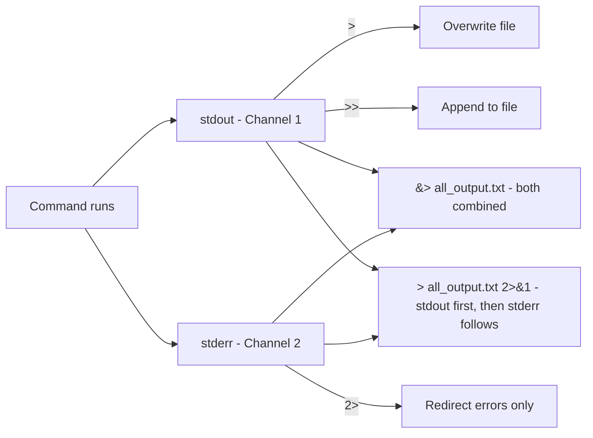
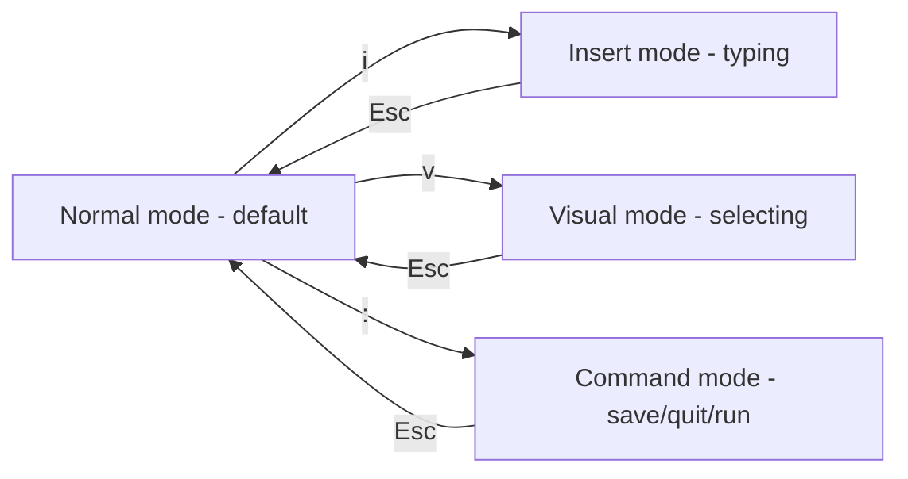

# Day 2 — Man Pages, Redirection, Pipelines, Vim, Variables, and User Types
*Notes by Sagda*

Day 2 notes covering man pages and getting help in Linux, I/O redirection, pipelines, `wc`, the Vim text editor and its modes, Bash shell variables, Linux user types by UID, switching users with `su`, and managing sudo permissions safely with `visudo`.

## 1. Man Pages — Getting Help in Linux

### What are man pages?

Every command in Linux comes bundled with its own official documentation, built right into the operating system. This is called a "man page" (short for manual page). Unlike searching the internet, man pages are always installed locally, always match the exact version of the command on your system, and work even if you have no internet connection — which matters a lot for servers.

```bash
man passwd
```

### Why man pages have numbered sections

Some words in Linux mean more than one thing. For example, `passwd` refers to:

1. A command you run to change a password
2. A file (`/etc/passwd`) that stores account information

If Linux just had one manual page per word, this would be confusing. So man pages are split into sections, each numbered:

| Section | What it documents | Example |
|---|---|---|
| 1 | Executable programs / user commands | `man 1 passwd` |
| 5 | File formats and configuration file structure | `man 5 passwd` |
| 8 | System administration commands (root-level) | `man 8 useradd` |

When you type `man passwd` without specifying a number, Linux shows you the lowest-numbered match it finds — usually the command page (section 1). If you specifically want the file-format explanation, you must ask for it directly with `man 5 passwd`.

Where these files physically live:

```bash
cd /usr/share/man
```

This folder contains subdirectories like `man1`, `man5`, `man8`, etc. — one folder per section — each holding the actual manual files. You'll rarely need to browse here manually, but it's good to know this isn't magic; it's just organized text files on disk.

### Checking if a command exists

```bash
whereis useradd
```

This tells you whether the command actually exists on this machine and where its files are stored (its binary program, its man page, and sometimes source files). This is useful troubleshooting before assuming "maybe this command isn't installed."

### Navigating inside an open man page

Man pages open using a "pager" program (usually called `less`), which lets you scroll through long text comfortably. Once inside, these keys help you move around:

| Key | What it does |
|---|---|
| `/word` | Searches forward through the page for "word" |
| `n` | Jumps to the next occurrence of your last search |
| `Shift + N` | Jumps to the previous occurrence |
| `Shift + G` | Jumps straight to the end of the document |
| `g` | Jumps straight to the beginning |
| `q` | Quits and returns you to your terminal prompt |

This matters because man pages can be extremely long (some run hundreds of lines), so scrolling manually line-by-line would waste a lot of time.

### Quick summary tools

`whatis` — gives you a one-line description instead of opening the whole manual:

```bash
whatis passwd
```

Output is something short like: "passwd - update user's authentication tokens" — enough to jog your memory without committing to reading a full page.

`man -k` — lets you search by topic instead of by exact command name:

```bash
man -k "print files"
```

This searches through the short description line of every man page installed on the system and shows you every command whose description matches your keyword. This is incredibly useful when you know what you want to accomplish but don't remember the exact command name for it.

> [!NOTE]
> Behind the scenes, `man -k` relies on a search database called `mandb`. If `man -k` returns nothing on a fresh system, an administrator may need to run `mandb` once to build that index.

`--help` — nearly every Linux command supports this flag:

```bash
useradd --help
```

This prints a condensed list of all available options for that command directly in your terminal — much faster than opening the full man page when you just need a quick reminder of what flags exist.

### When to use which tool

| Situation | Tool |
|---|---|
| Know the command, want full details | `man command` |
| Know the command, just want a one-liner | `whatis command` |
| Know the command, just want the option flags | `command --help` |
| Don't know the command name at all | `man -k "keyword"` |

## 2. Redirection — Controlling Where Data Goes

### The concept

Every command you run in Linux is silently connected to three data channels:

1. Input — where the command reads data from (by default, your keyboard)
2. Output — where the command sends its normal results (by default, your screen)
3. Error — where the command sends error/warning messages (by default, also your screen)

Linux internally labels these with numbers called File Descriptors (FDs):

| Stream name | Purpose | File Descriptor number |
|---|---|---|
| Standard Input (stdin) | Where the command reads input from | 0 |
| Standard Output (stdout) | Where normal results go | 1 |
| Standard Error (stderr) | Where error messages go | 2 |

Redirection means telling Linux "instead of the default location, send this stream somewhere else — usually into a file." This is one of the most powerful ideas in the Linux command line because it lets you automate things without ever touching a mouse or GUI.

### Overwrite redirection: `>`

```bash
ls -l > list.txt
```

This runs `ls -l` (list files with details) and instead of showing the results on your screen, sends them into a file called `list.txt`.

> [!WARNING]
> If `list.txt` already exists and has content, `>` will completely erase that content first, then write the new output. There's no confirmation prompt — it just happens. This is called overwriting, and it's the #1 way beginners accidentally lose data, so always double-check the filename before using a single `>`.

### Append redirection: `>>`

```bash
date >> list.txt
```

This runs `date` (which prints today's date and time) and adds that output to the end of `list.txt`, without touching or deleting whatever was already inside the file. Think of `>` as "replace the file" and `>>` as "add onto the file." This is exactly what you'd use to build up a running log over time — for example, appending a timestamp to a log file every time a script runs.

### Input redirection: `<`

So far we've talked about output — but you can redirect input too. Normally, a command like `sort` waits for you to type names one by one on the keyboard. Instead, you can tell it to read directly from a file:

```bash
sort < names.txt
```

This makes `sort` read all the lines already stored in `names.txt` and immediately sort them alphabetically, without you needing to type anything interactively. This is less common day-to-day than output redirection, but it's important conceptually: input, output, and error are three separate, independently redirectable channels.

### Error-only redirection: `2>`

Because errors have their own File Descriptor (2), you can redirect only the errors, leaving normal output untouched:

```bash
find / -name passwd 2> /dev/null
```

Let's unpack this real-world example:

- `find / -name passwd` searches the entire filesystem (starting from `/`, the root) for anything named `passwd`
- Because this search touches nearly every folder on the system, it will try to peek into directories you don't have permission to access — and each of those attempts generates a "Permission denied" error
- `2>` grabs only those error messages (Channel 2) and sends them into `/dev/null`
- `/dev/null` is a special file built into Linux that acts like a black hole — anything written into it is instantly discarded and gone forever. It's the standard way to "throw away" unwanted output.
- Meanwhile, the actual successful search results (the file paths it did find) are not affected — they still print normally to your screen, because you only redirected Channel 2, not Channel 1

This pattern (`2> /dev/null`) is extremely common in real system administration to keep your terminal clean while running system-wide searches.

### Combining output and error redirection

Sometimes you want both the normal results and the error messages saved — either together in one file, or split into two separate files.

Splitting into two separate files:

```bash
find / -name passwd > results.txt 2> errors.txt
```

Successful matches go into `results.txt`; error messages go into `errors.txt`.

`&>` — the modern shorthand for combining both into ONE file:

```bash
command &> all_output.txt
```

This single symbol tells Linux "send both the normal output AND the errors into this same file." It's a shortcut that saves you from writing two separate redirections.

`2>&1` — the traditional (older, more explicit) method for combining streams:

```bash
command > all_output.txt 2>&1
```

This reads as: "send normal output (Channel 1) into `all_output.txt`, THEN also redirect errors (Channel 2) into wherever Channel 1 is currently pointing." The order matters here — `2>&1` must come after the `>` redirection, and it must be placed at the end of the command, because Linux processes these redirections left to right, and Channel 2 needs to know where Channel 1 is already pointing before it can copy that destination.



## 3. Pipelines — Connecting Commands Together

### The concept

A pipeline is similar to redirection, but instead of sending a command's output into a file, it sends that output directly into another command as that command's input — with no file ever being created in between. The symbol used is the vertical bar `|`, called a "pipe."

```bash
ls -l | grep ^-
```

Let's break this down step by step:

1. `ls -l` runs first, producing a detailed list of files and folders, where each line starts with a permission code like `drwxr-xr-x` (directories) or `-rw-r--r--` (regular files)
2. The `|` takes that entire output and feeds it directly into the next command, `grep`, as if you had typed it in yourself
3. `grep ^-` searches through those lines and keeps only the ones that start with a dash `-` — because in `ls -l` output, a leading `d` means directory, a leading `l` means symbolic link, and a leading `-` specifically means "this is a regular file"

So the whole pipeline answers a specific question: "Show me only the actual files in this folder — skip the folders and shortcuts."

You can even chain multiple pipes together (`cmd1 | cmd2 | cmd3`), passing data through several filtering steps in sequence — this is one of Linux's most powerful features, letting you build complex operations out of small, simple tools.

## 4. wc — Word Count

### What it does

`wc` stands for word count, and despite the name, it actually counts three things at once: lines, words, and characters.

```bash
echo "nti aiops" | wc
```

Here, `echo "nti aiops"` simply prints the text `nti aiops`, and that text is piped into `wc`, which analyzes it. The output has three numbers, always in this order:

| Lines | Words | Characters |
|---|---|---|
| 1 | 2 | 10 |

- 1 line — because `echo` only produced one line of text
- 2 words — "nti" and "aiops" are two separate words
- 10 characters — counting every letter and the space between them

### Getting just ONE of these numbers

Often you don't need all three — just one specific count. You can add a flag to `wc` to isolate exactly what you want:

```bash
echo "nti aiops" | wc -w
```

This returns only the word count (2), with nothing else cluttering the output.

| Flag | Returns |
|---|---|
| `wc -l` | Line count only |
| `wc -w` | Word count only |
| `wc -c` | Character count only |

### Combining wc with other commands

```bash
ls -R /etc | wc -l
```

- `ls -R /etc` lists everything inside `/etc`, and the `-R` flag makes it recursive — meaning it doesn't just list the top-level folder, it digs into every subfolder inside it too, listing everything at every depth
- Piping that into `wc -l` counts how many total lines were produced — effectively telling you how many files and folders exist inside `/etc` and all its subfolders combined

This shows how small commands combine into powerful one-liners: instead of manually counting hundreds of files, one line does it instantly.

## 5. Vim / Vi — The Command-Line Text Editor

### Why vim exists

Most Linux servers don't have a graphical interface at all — no mouse, no windows, no Notepad-style app. So editing configuration files, scripts, or any text must happen entirely from the terminal. `vim` (an improved version of the older `vi`) is the most widely used tool for this.

```bash
vim myfile.txt
```

- If `myfile.txt` doesn't exist yet, vim creates a brand-new empty file with that name and opens it, ready for you to start typing
- If it already exists, vim opens it and displays its current content on screen, ready for editing

### The core concept: Modes

This is the single most important thing to understand about vim, and the thing that confuses almost every beginner: the same keyboard keys do completely different things depending on which "mode" vim is currently in. Vim is called a "modal" editor for exactly this reason.

| Mode | What it's for | How you enter it |
|---|---|---|
| Normal mode | The default mode vim opens in. Used for moving around, deleting lines, copying text — but not for typing new text | Press `Esc` from any other mode |
| Insert mode | The mode where your keyboard behaves like a normal text editor — every key you press types a character | Press `i` while in Normal mode |
| Visual mode | Lets you highlight/select a block of text (like dragging with a mouse, but with the keyboard) — useful before copying or deleting a chunk at once | Press `v` while in Normal mode |
| Command mode | Used to save the file, quit, or run other special commands | Press `:` while in Normal mode |

> [!TIP]
> The golden safety rule: if you're ever confused about what mode you're currently in, just press `Esc`. This always returns you to Normal mode no matter where you were — it's your "reset button" and there's no danger in pressing it too often.

A typical beginner workflow looks like:

1. Open the file: `vim file.txt`
2. You start in Normal mode — press `i` to switch to Insert mode
3. Type your text normally
4. Press `Esc` to leave Insert mode and return to Normal mode
5. Press `:` to enter Command mode, then type a save/quit command



### Saving and quitting (all typed after pressing `:`)

| Command | What it does |
|---|---|
| `:w` | Write (save) your changes, but keep the file open for more editing |
| `:wq` | Write and quit — save your changes AND close vim in one step |
| `:q!` | Quit without saving — discard all changes you made since opening the file. Use this if you made a mistake and just want to bail out |
| `:wq!` | Force-save and quit, even if there's some restriction normally preventing it (e.g., a read-only warning you have permission to override) |
| `:! command` | Run any shell command from inside vim without fully leaving the editor. For example, `:! date` runs the `date` command, shows you its output, and then returns you right back to your file exactly where you left off |

## 6. Bash Shell Variables

### What a variable is

A variable is simply a name that holds a piece of data, so you (or the system) can reuse that data later without retyping it. This concept exists in virtually every programming and scripting language, and Bash (the shell/command interpreter) is no exception.

### Bash itself

Bash stands for "Bourne Again SHell," and it is the default shell used in Red Hat Enterprise Linux — meaning it's the actual program running behind the scenes that reads every command you type, interprets it, and executes it. When you open a "terminal," you're really talking directly to Bash.

### Two categories of variables

1. Shell variables — these come built into Bash automatically and are used for configuration purposes. Examples include `$PATH` (a list of folders Bash searches through to find commands), `$HOME` (your home directory location), and `$USER` (your current username). You don't need to create these; they already exist the moment your shell starts.
2. User-defined variables — these are variables you create yourself to temporarily store any value you want during your session.

```bash
x=5
```

This creates a variable named `x` holding the value 5. Important: this variable is local to your current shell session only — if you open a new shell process from within this one (called a "sub-shell"), that sub-shell has no knowledge that `x` even exists.

### export — sharing variables with sub-shells

```bash
export x
```

`export` marks a variable so that it becomes visible to any sub-shell you open afterward, with the exact same name and value. Without `export`, a variable stays trapped in your current shell only.

Here's a way to test and truly understand this:

```bash
x=5 # create a plain variable
bash # open a new sub-shell (a shell inside your shell)
echo $x # prints NOTHING — this sub-shell never inherited x
exit # leave the sub-shell, back to the original
export x=5 # create AND export in one step
bash # open a new sub-shell again
echo $x # prints 5 — this time it WAS inherited
```

### set — viewing everything currently defined

```bash
set
```

This displays a full listing of every currently defined variable in your shell session — both the built-in shell variables and any custom ones you've created. It's typically a long list, useful mainly when troubleshooting or exploring what's already set.

## 7. Linux User Types (by UID)

### What a UID is

Every user account on a Linux system — human or automated — has a unique numeric identifier called a UID (User ID). Linux uses this number internally to track ownership of files, processes, and permissions; usernames are really just human-friendly labels attached to these numbers.

### The three categories

| Type | UID Range | What it means |
|---|---|---|
| Super user (root) | 0 | There is only ever one UID 0 account: root, the single all-powerful administrator with unrestricted access to the entire system |
| System user | 1–200 (statically reserved by the OS itself, used for core system services) and 201–999 (dynamically assigned as software installs and creates its own service accounts) | These accounts exist to run background services/daemons — for example, the account that runs a web server or database process. They are not meant for humans to log into directly. |
| Regular user | 1000 and above | These are the normal, everyday human accounts — created by an administrator so real people can log in, have their own home folder, and do their own work |

> [!NOTE]
> Understanding these ranges matters practically: if you ever list users on a system and see a UID under 1000, you immediately know "this is a service account, not a person" — which is important context when auditing security or troubleshooting.

## 8. Switching Users — su

### `su - username` (with the dash)

```bash
su - omar
```

This switches you to being the user `omar`. The dash (`-`) is crucial: it tells Linux to also load `omar`'s entire environment, exactly as if `omar` had logged in directly himself — his home directory becomes your working directory, his shell configuration and variables load, his PATH becomes active. It will also display when `omar` last logged in, similar to what you'd see on a real login screen.

### `su username` (without the dash)

```bash
su omar
```

This still switches you to being `omar`, but it's a lighter switch — you keep your own current environment and variables rather than fully adopting his, and you typically remain in whatever directory you were already in rather than jumping to his home folder.

### Comparison

| Behavior | `su - username` | `su username` |
|---|---|---|
| Environment loaded | Full environment, exactly as if that user logged in directly | Keeps your own current environment and variables |
| Working directory | Jumps to that user's home directory | Typically remains in whatever directory you were already in |
| Last login display | Shown, similar to a real login screen | Not part of this lighter switch |
| Best for | A true, full simulation of that user logging in (the safer, more predictable choice) | A quick, temporary permission switch without changing your whole environment |

## 9. visudo — Safely Managing Sudo Permissions

### The file behind sudo

Every time someone runs a command with `sudo`, Linux checks a specific configuration file — `/etc/sudoers` — to decide whether that user is allowed to do that, and what exactly they're permitted to run (sometimes limited to specific commands, sometimes full access).

### Why not just edit it with vim directly?

You technically could open `/etc/sudoers` with `vim /etc/sudoers`, but this is considered dangerous, because a single typo in this file could silently break the entire permissions system — potentially locking every single administrator out of sudo access at once, with no easy way back in.

```bash
visudo
```

> [!DANGER]
> Editing `/etc/sudoers` directly with a regular editor is dangerous — a single typo can silently break the entire permissions system, potentially locking every administrator out of sudo access at once, with no easy way back in.

`visudo` solves this by opening the file in a protected editing session that automatically checks your syntax for errors the moment you try to save. If it detects a mistake, it stops you, shows a warning, and refuses to save the broken version — giving you the chance to fix it or discard your changes safely. This built-in safety check is the entire reason `visudo` exists as a dedicated command instead of people just using a regular text editor.

## Flashcards

**Q: Why do man pages have numbered sections, and what do sections 1, 5, and 8 document?**
A: Because some words (like "passwd") refer to more than one thing. Section 1 documents executable programs/user commands, section 5 documents file formats and configuration file structure, and section 8 documents system administration commands (root-level).

**Q: What does `man passwd` show by default if you don't specify a section number?**
A: It shows the lowest-numbered match it finds, usually the command page (section 1).

**Q: What's the difference between `man`, `whatis`, and `command --help`?**
A: `man command` gives full details, `whatis command` gives a one-line description, and `command --help` prints a condensed list of that command's available options.

**Q: What does `man -k "keyword"` do, and what does it rely on behind the scenes?**
A: It searches the short description line of every installed man page for the keyword and lists matching commands. It relies on the `mandb` search database, which may need to be built with `mandb` on a fresh system.

**Q: What does `whereis useradd` tell you?**
A: Whether the command exists on the machine and where its files are stored (binary, man page, and sometimes source files).

**Q: What are the three data channels (streams) every Linux command is connected to, and their File Descriptor numbers?**
A: Standard Input (stdin, FD 0), Standard Output (stdout, FD 1), and Standard Error (stderr, FD 2).

**Q: What's the difference between `>` and `>>`?**
A: `>` overwrites the target file's contents completely with no warning; `>>` appends new output to the end of the file without touching existing content.

**Q: What does `find / -name passwd 2> /dev/null` do?**
A: It searches the entire filesystem for "passwd" and discards only the error messages (like "Permission denied") by sending them to `/dev/null`, while successful results still print normally to the screen.

**Q: What's the difference between `&>` and `2>&1`?**
A: `&>` is a modern shorthand that sends both stdout and stderr into one file in a single symbol. `2>&1` is the traditional method that must come after a `>` redirection and works by pointing stderr (Channel 2) to wherever stdout (Channel 1) is already going.

**Q: What does the pipeline `ls -l | grep ^-` do?**
A: It lists files in long format, then filters to show only lines starting with `-`, which represents regular files (as opposed to `d` for directories or `l` for symbolic links).

**Q: What three things does `wc` count, and in what order does it print them?**
A: Lines, words, and characters, always in that order.

**Q: What does `ls -R /etc | wc -l` tell you?**
A: The total number of files and folders inside `/etc` and all its subfolders combined, since `-R` makes the listing recursive and `wc -l` counts the resulting lines.

**Q: What are the four main modes in vim, and how do you enter each?**
A: Normal mode (default, entered by pressing `Esc`), Insert mode (press `i` from Normal mode), Visual mode (press `v` from Normal mode), and Command mode (press `:` from Normal mode).

**Q: What's the difference between `:wq` and `:q!` in vim?**
A: `:wq` saves your changes and quits; `:q!` quits without saving, discarding all changes made since opening the file.

**Q: What's the difference between a shell variable and a user-defined variable in Bash?**
A: Shell variables (like `$PATH`, `$HOME`, `$USER`) are built into Bash automatically for configuration purposes. User-defined variables are ones you create yourself to temporarily store values during your session.

**Q: What does `export` do to a variable, and what happens without it?**
A: `export` makes a variable visible to any sub-shell opened afterward, with the same name and value. Without `export`, the variable stays trapped only in the current shell and sub-shells have no knowledge of it.

**Q: What are the three UID categories in Linux, and their ranges?**
A: Super user (root) is UID 0; system users are UID 1–999 (1–200 statically reserved, 201–999 dynamically assigned); regular users are UID 1000 and above.

**Q: What's the difference between `su - username` and `su username`?**
A: `su - username` fully loads that user's environment as if they logged in directly (home directory, shell config, PATH, last-login display). `su username` is a lighter switch that keeps your own current environment and directory.

**Q: Why should you use `visudo` instead of editing `/etc/sudoers` directly with vim?**
A: `visudo` opens the file in a protected session that checks syntax for errors before saving, refusing to save a broken version. Editing directly with vim risks a typo silently breaking the entire permissions system and locking out all administrators.
